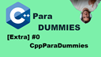

# 00_cppfordummies

  
[**Castellano**](#Castellano) - Esta documentación se realiza en varios idiomas. 
[**English**](#English) - This documentation has been written in multiple languages.  

## Castellano
---

En este vídeo hablo un poco de como esta estructurado C++ para Dummies, y cuales son los planes para la serie tanto normal, como los capítulos extra.
También intento explicar como son las ideas que tengo dentro de la serie.
Cuales son los capítulos extra que ya tengo pensados, y también alguna idea de algún capítulo que haré en el futuro.
Además de pediros ideas, y peticiones.

## English
---

In this video, I talk a bit about how C++ for Dummies is structured and what the plans are for both the regular series and the extra chapters. I also try to explain the ideas that I have within the series, including the extra chapters that I already have in mind and some ideas for future episodes. In addition, I ask for your ideas and requests.
