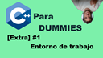

# 00_cppfordummies

  
[**Castellano**](#Castellano) - Esta documentación se realiza en varios idiomas. 
[**English**](#English) - This documentation has been written in multiple languages.  

## Castellano
---

En este vídeo, hablamos de cual es el entorno en el que trabajamos, porqué en el primer episodio trabajamos en un terminal (WSL2.0 Ubuntu) y en los siguientes trabajamos en otro, pues aquí tenemos la explicación, es un vídeo sencillito, pero creo que importante para dar un poco de contexto.

## English
---

In this video, we talk about the environment we work in. We explain why we work in a terminal (WSL2.0 Ubuntu) in the first episode and in a different one in the following episodes. This is a simple video, but I think it's important to give you some context.
