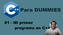
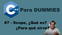
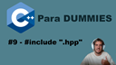
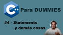
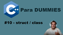
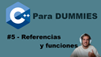
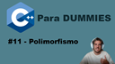
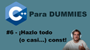

# CppForDummies
En este repositorio, tenemos todos los cursos, separados por vídeos de mi curso [C++ para Dummies](https://www.youtube.com/playlist?list=PLBEviA0cKSig6dyALSeIm6lGQhoCi3wL6) la cual aprendemos C++ (que no C) de una forma sencilla, moderna y fácil.  
Además estos vídeos están creados con ánimo de aprender, y siempre pueden ser modificados y/o extendidos.  
Estos vídeos no deben ser nunca tomados como una muestra de mis conocimientos, puesto que intento simplificar lo máximo posible mis explicaciones para no sobresaturar a la persona que esté aprendiendo, además de intentar hacer vídeos cortos.

---

In this repository, we have all the courses, separated by videos from my course **IN SPANISH** [C++ for Dummies](https://www.youtube.com/playlist?list=PLBEviA0cKSig6dyALSeIm6lGQhoCi3wL6), where we learn C++ (not C) in a simple, modern, and easy-to-understand way.  
Furthermore, these videos are created with the intention of learning, and they can always be modified and/or extended.  
These videos should never be taken as a representation of my knowledge, as I aim to simplify my explanations as much as possible to avoid overwhelming the person who is learning, in addition to trying to create short videos.

## Tecnologías / Technologies
- Arch WSL2.0 en Windows 11
- GCC/Clang
- VSCode
- C++23

## Capítulos / Chapters

| Capítulo                            | Vídeo de Youtube                                                                                | | Capítulo                            | Vídeo de Youtube  |
| :---------------------------------: | :---------------------------------------------------------------------------------------------: |-| :---------------------------------: | ----------------: |
| [01_firstProgram](/Courses/01_firstProgram) |  |&emsp;&emsp;&emsp;|          [07_scopes](/Courses/07_scopes)    |  |
|   [02_helloWorld](/Courses/02_helloWorld)   |        |&emsp;&emsp;&emsp;|       [08_templates](/Courses/08_templates) |  |
|   [03_otherTypes](/Courses/03_otherTypes)   |                |&emsp;&emsp;&emsp;|                [09_hpp](/Courses/09_hpp)    |  |
|   [04_statements](/Courses/04_statements)   |     |&emsp;&emsp;&emsp;|            [10_class](/Courses/10_class)    |  |
|   [05_references](/Courses/05_references)   |      |&emsp;&emsp;&emsp;| [11_polymorphism](/Courses/11_polymorphism) |  |
|        [06_const](/Courses/06_const)        |    |&emsp;&emsp;&emsp;|

## Extra
- [00_cppfordummies](Extra/00_cppfordummies/README.md) : Hablamos sobre C++ para Dummies.
   - We talk about C++ for Dummies.
- [01_02_environment](Extra/01_02_environment/README.md) : Hablamos sobre el entorno en el que trabajamos.
   - We talk about the environment where we are currently working.
- [02_02_cpp23HelloWorld](Extra/02_02_cpp23HelloWorld/README.md) : Vídeo sobre el nuevo Hello World (desde C++23).
   - Video to newest C++23's Hello World.
- [04_02_statements_extra](Extra/04_02_statements_extra/README.md) : Un vídeo más detallado sobre algunos statements de C++.
   - A more detailed video about C++ statements.
- [09_02_modules](Extra/09_02_modules/README.md) : En vez de incluír ficheros, usamos import en C++20 (o superior).
   - Instead of including files, we are using C++20 (or above) import.
- [11_02_raii](Extra/11_02_raii/README.md) : Haremos un pequeño ejemplo de RAII.
   - We will do a tiny RAII example.

# Get in Touch
If you want to get in touch with me, here are my social networks
- [Twitter](https://x.com/conPdePABLO)
- [BlueSky](https://bsky.app/profile/theapoca.bsky.social)
- [Youtube](https://www.youtube.com/@conpdepab)
- [Instagram](https://www.instagram.com/conpdepab/)
- [LinkedIn](https://www.linkedin.com/in/parequena/)
